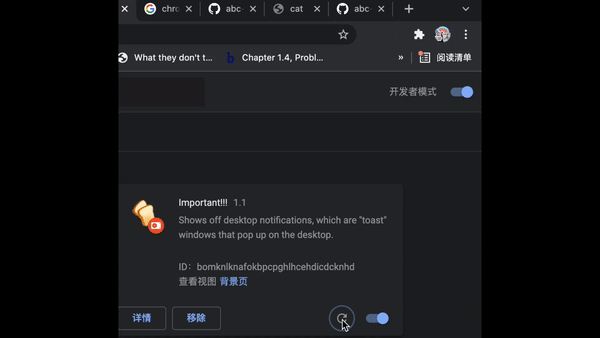

# Time to Go

[link to the zip](https://github.com/clover0208/abc-student-repo/blob/master/coding-exercise/real-mini05/mini05.zip)

## Description
I build this project to make sure I eat all lunch and do stuff regularly. If you wait for some moment, you will see the notification show up. I will reminds you to eat lunch, dancing, do some coding, and go to dinner. Sometimes, I may forget to eat lunch or dinner, so I made this to remind myself and also anyone who forget to do things regularly
